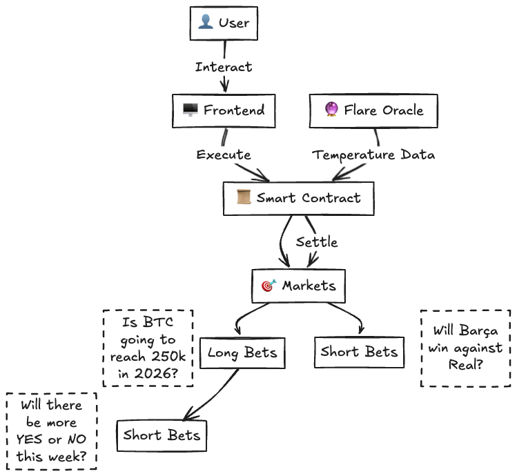

# GuantanamoBets

## Description

GuantanamoBets is a decentralized prediction market platform built on the Mina Protocol. It enables users to create and participate in temperature-based prediction markets with a unique two-layer betting system:

- **Long Bets**: Primary markets where users predict if the temperature will exceed a specific threshold
- **Short Bets**: Secondary markets derived from Long Bets where users predict the voting behavior of the primary market

The platform leverages Flare Network's oracle for reliable temperature data and settlement. Built with a modern stack including Next.js for the frontend and o1js for zero-knowledge smart contracts.

## Flowchart



## Features

- Create Long and Short prediction markets
- Place bets on market outcomes
- Real-time temperature data from Flare Oracle
- Automated market settlement
- Zero-knowledge privacy preservation
- User-friendly interface with real-time updates
- Secure wallet integration

## Tech Stack

- Next.js
- o1js
- Flare Network

## Branches

- `main`: Main branch for the project
- `Bet-Circuit`: Branch with the working bet circuit

## Run the project

requirements:
node 18.18

```bash
cd starter-kit
nvm use 18.18
pnpm install
pnpm env:inmemory dev
```

## Contracts:

- `PredictionMarket.ts`: Main contract for creating and managing prediction markets can be found in `starter-kit/packages/chain/src/runtime/modules/PredictionMarket.ts`

- `WeatherOracle.ts`: Contract for fetching temperature data from the Flare Network can be found in `flare/contracts/WeatherOracle.sol`

## Contract address:

The flare contract is deployed on the Flare testnet costom chain:

https://coston.testnet.flarescan.com/address/0xd7eba1a0EE1423C07E1cB842972e2afB5130Fd00/contract/16/code

- `WeatherOracle`: `0xd7eba1a0EE1423C07E1cB842972e2afB5130Fd00`
